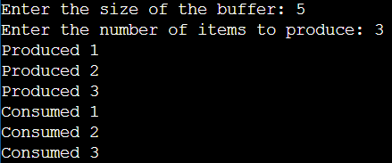

## 1. Write a C program for the bounded buffer producer-consumer problem using semaphores.

```c
#include <pthread.h>
#include <stdlib.h>
#include <stdio.h>
#include <semaphore.h>

int capacity;
int *queue;
int max;
sem_t full, empty;
pthread_mutex_t mutex = PTHREAD_MUTEX_INITIALIZER;

// Producer thread function
void *producer(void *param) {
    int in = 0;
    int i;
    for (i = 0; i < max; i++) {
        // Wait for an empty slot in the buffer
        sem_wait(&empty);
        // Lock the mutex to access the shared buffer
        pthread_mutex_lock(&mutex);
        // Produce an item and add it to the buffer
        queue[in] = i + 1;
        in = (in + 1) % capacity;
        printf("Produced %d\n", i + 1);
        // Unlock the mutex and signal that the buffer is now full
        pthread_mutex_unlock(&mutex);
        sem_post(&full);
    }
}

// Consumer thread function
void *consumer(void *param) {
    int out = 0;
    int i;
    for (i = 0; i < max; i++) {
        // Wait for a full slot in the buffer
        sem_wait(&full);
        // Lock the mutex to access the shared buffer
        pthread_mutex_lock(&mutex);
        // Consume an item from the buffer
        printf("Consumed %i\n", queue[out]);
        out = (out + 1) % capacity;
        // Unlock the mutex and signal that the buffer is now empty
        pthread_mutex_unlock(&mutex);
        sem_post(&empty);
    }
}

int main() {
    // Get the buffer size and the number of items to produce from the user
    printf("Enter the size of the buffer: ");
    scanf("%d", &capacity);
    printf("Enter the number of items to produce: ");
    scanf("%d", &max);

    // Allocate memory for the buffer
    queue = malloc(capacity * sizeof(int));

    // Initialize semaphores and mutex
    sem_init(&full, 0, 0);
    sem_init(&empty, 0, capacity);

    // Create producer and consumer threads
    pthread_t threads[2];
    pthread_create(&threads[0], 0, producer, 0);
    pthread_create(&threads[1], 0, consumer, 0);

    // Wait for threads to finish
    pthread_join(threads[0], 0);
    pthread_join(threads[1], 0);

    // Cleanup: Destroy semaphores
    sem_destroy(&full);
    sem_destroy(&empty);
}


```
## Output


### Explanation 

### Bounded Buffer Producer-Consumer Problem

#### Problem Description
The bounded buffer producer-consumer problem models a situation where multiple producer threads generate data, place it into a shared buffer, and multiple consumer threads retrieve and process this data. The challenge is to ensure that the producers don't overflow the buffer (exceed its capacity) and that consumers don't underflow it (try to consume when the buffer is empty).

#### Synchronization Elements
This code implements the solution using semaphores:

- **empty**: Represents the number of empty slots in the buffer.
- **full**: Represents the number of slots that contain data in the buffer.
- **mutex**: Ensures mutual exclusion when accessing the buffer.

#### Implementation Overview
- The code defines two types of threads, one for the producer and one for the consumer.
- The producer generates data and adds it to the buffer, making sure it doesn't exceed the buffer's capacity.
- The consumer retrieves and processes data from the buffer, avoiding buffer underflow.
- The threads are synchronized using semaphores to coordinate access to the shared buffer.

#### Usage
1. Compile the code, for example: `gcc bounded_buffer.c -o bounded_buffer -lpthread`.
2. Run the executable: `./bounded_buffer`.
3. The program will create producer and consumer threads that run concurrently.
4. Threads will run for a specified duration (e.g., 10 seconds) and then exit gracefully.

#### Customization
You can customize this code by changing the `BUFFER_SIZE` and the data generated by the producer to fit your requirements.

#### Cleanup
The program cleans up and destroys the semaphores when it finishes execution.

---

This README-style explanation provides an overview of a practical solution to the bounded buffer producer-consumer problem using semaphores in C. It ensures efficient coordination between producers and consumers while avoiding buffer overflows and underflows.
