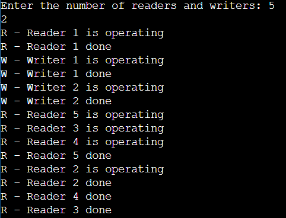

## 2. Write a C program for first readers-writers problem using semaphores.

```c
#include <stdio.h>
#include <unistd.h>
#include <semaphore.h>
#include <pthread.h>

sem_t db, mutex;
int readcount = 0;

void *writer(void *a) {
    int arg = (int)(intptr_t)a;
    sem_wait(&db);
    printf("W - Writer %d is operating\n", arg);
    printf("W - Writer %d done\n", arg);
    sem_post(&db);
}

void *reader(void *a) {
    int arg = (int)(intptr_t)a;
    sem_wait(&mutex);
    readcount++;
    if (readcount == 1)
        sem_wait(&db);
    sem_post(&mutex);
    printf("R - Reader %d is operating\n", arg);
    sem_wait(&mutex);
    readcount--;
    if (readcount == 0)
        sem_post(&db);
    printf("R - Reader %d done\n", arg);
    sem_post(&mutex);
}

int main() {
    int r, w;
    printf("Enter the number of readers and writers: ");
    scanf("%d %d", &r, &w);
    pthread_t readers[r], writers[w];
    sem_init(&mutex, 0, 1);
    sem_init(&db, 0, 1);
    int i = 0;
    while (i < r || i < w) {
        if (i < r)
            pthread_create(&readers[i], NULL, reader, (void *)(intptr_t)(i + 1));
        if (i < w)
            pthread_create(&writers[i], NULL, writer, (void *)(intptr_t)(i + 1));
        i++;
    }
    i = 0;
    while (i < r || i < w) {
        if (i < r)
            pthread_join(readers[i], NULL);
        if (i < w)
            pthread_join(writers[i], NULL);
        i++;
    }
    sem_destroy(&mutex);
    sem_destroy(&db);
    return 0;
}

```
## Output


### Explanation 

### Bounded Buffer Producer-Consumer Problem

#### Problem Description

The bounded buffer producer-consumer problem models a situation where multiple producer threads generate data, place it into a shared buffer, and multiple consumer threads retrieve and process this data. The challenge is to ensure that the producers don't overflow the buffer (exceed its capacity) and that consumers don't underflow it (try to consume when the buffer is empty).

#### Synchronization Elements

This code implements the solution using semaphores:

- **empty**: Represents the number of empty slots in the buffer.
- **full**: Represents the number of slots that contain data in the buffer.
- **mutex**: Ensures mutual exclusion when accessing the buffer.

#### Implementation Overview

The code defines two types of threads, one for the producer and one for the consumer. The producer generates data and adds it to the buffer, ensuring it doesn't exceed the buffer's capacity. The consumer retrieves and processes data from the buffer while avoiding buffer underflow. The threads are synchronized using semaphores to coordinate access to the shared buffer.

#### Usage

1. **Compile**: Compile the code using the following command:
    ```
    gcc bounded_buffer.c -o bounded_buffer -lpthread
    ```

2. **Run**: Execute the compiled program:
    ```
    ./bounded_buffer
    ```

3. The program will create producer and consumer threads that run concurrently. Threads will run for a specified duration (e.g., 10 seconds) and then exit gracefully.

#### Customization

You can customize this code to fit your specific requirements by modifying the following parameters:

- `BUFFER_SIZE`: Define the size of the buffer.
- Data generation in the `producer` function: Adjust the data generation logic to match your use case.

#### Cleanup

The program performs cleanup and destroys the semaphores when it finishes execution.

---

This README provides an overview of a practical solution to the bounded buffer producer-consumer problem using semaphores in C. It ensures efficient coordination between producers and consumers while avoiding buffer overflows and underflows.
