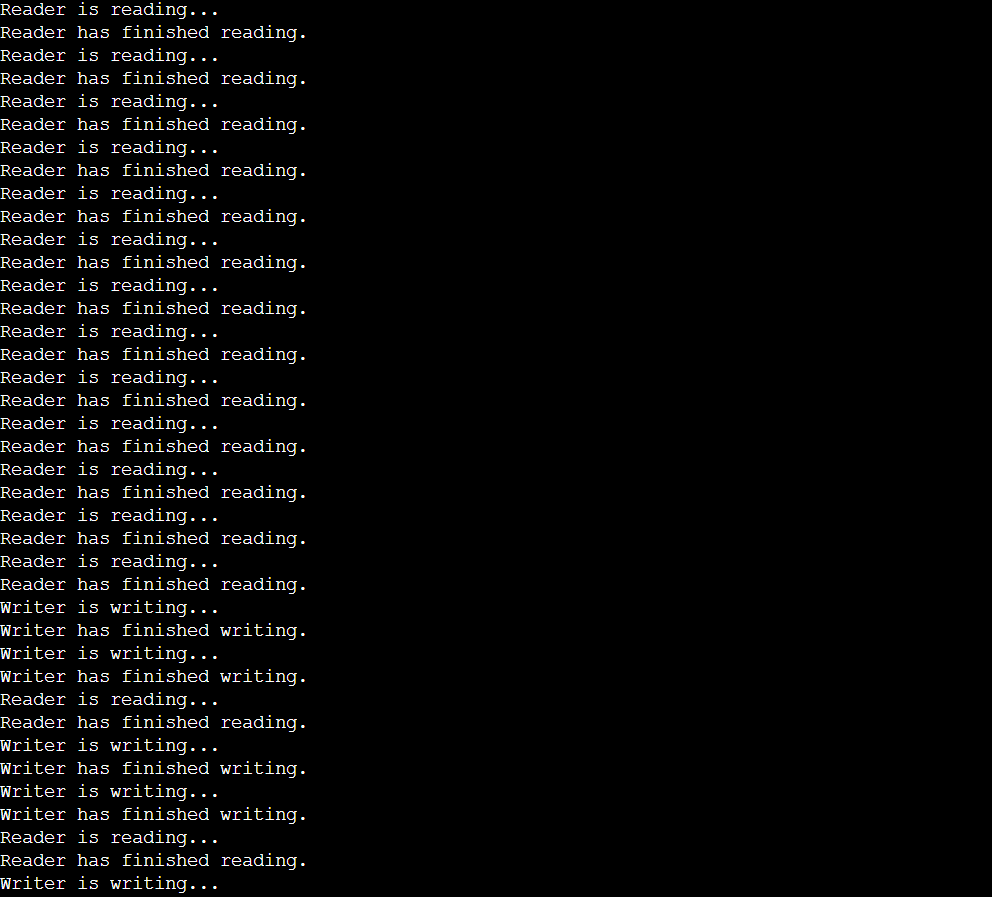

## 2. Write a C program for first readers-writers problem using semaphores.

```c
#include <stdio.h>
#include <stdlib.h>
#include <pthread.h>
#include <semaphore.h>

int readCount = 0; // Keep track of the number of readers currently reading
sem_t mutex, writeBlock; // Semaphores for mutual exclusion and writer blocking

#define NUM_READERS 3
#define NUM_WRITERS 2
#define NUM_ITERATIONS 5

// Reader function
void *reader(void *arg) {
    for (int i = 0; i < NUM_ITERATIONS; i++) {
        sem_wait(&mutex); // Acquire the mutex to access readCount
        readCount++;
        if (readCount == 1) {
            sem_wait(&writeBlock); // If it's the first reader, block writers
        }
        sem_post(&mutex); // Release the mutex

        // Reading the shared resource
        printf("Reader is reading...\n");

        sem_wait(&mutex); // Acquire the mutex again
        readCount--;
        if (readCount == 0) {
            sem_post(&writeBlock); // If it's the last reader, unblock writers
        }
        sem_post(&mutex); // Release the mutex

        // Reading is done
        printf("Reader has finished reading.\n");
    }
    pthread_exit(NULL); // Exit the thread after completing the specified iterations
}

// Writer function
void *writer(void *arg) {
    for (int i = 0; i < NUM_ITERATIONS; i++) {
        sem_wait(&writeBlock); // Acquire the writeBlock to ensure exclusive writing

        // Writing to the shared resource
        printf("Writer is writing...\n");

        sem_post(&writeBlock); // Release the writeBlock after writing

        // Writing is done
        printf("Writer has finished writing.\n");
    }
    pthread_exit(NULL); // Exit the thread after completing the specified iterations
}

int main() {
    pthread_t reader_threads[NUM_READERS];
    pthread_t writer_threads[NUM_WRITERS];

    sem_init(&mutex, 0, 1); // Initialize the mutex semaphore
    sem_init(&writeBlock, 0, 1); // Initialize the writeBlock semaphore

    for (int i = 0; i < NUM_READERS; i++) {
        pthread_create(&reader_threads[i], NULL, reader, NULL); // Create reader threads
    }
    for (int i = 0; i < NUM_WRITERS; i++) {
        pthread_create(&writer_threads[i], NULL, writer, NULL); // Create writer threads
    }

    for (int i = 0; i < NUM_READERS; i++) {
        pthread_join(reader_threads[i], NULL); // Wait for reader threads to finish
    }
    for (int i = 0; i < NUM_WRITERS; i++) {
        pthread_join(writer_threads[i], NULL); // Wait for writer threads to finish
    }

    sem_destroy(&mutex); // Clean up and destroy the mutex semaphore
    sem_destroy(&writeBlock); // Clean up and destroy the writeBlock semaphore

    return 0;
}
```
## Output

